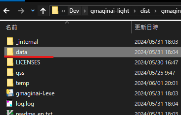

# gmaginai-l - 異世界の創造者 Modマネージャー

(gif中で使用しているmodはめじ氏作の[`showabilities`](https://discord.com/channels/1234695202615197746/1234751996595015710/1245000749952532480)です🙌)

[English](README.md) | [日本語](README_ja.md)
## 機能

- Steam版（Windows）およびDLSite版の異世界の創造者に対応
- Modローダー[maginai](https://github.com/Spoonail-Iroiro/maginai)をオンラインインストール
- 配布zipファイルまたはModの本体フォルダからModをインストール
- ゲームの起動（開発者コンソール起動も対応）
- プロファイルで複数のゲームフォルダとそれぞれのModの管理が可能

すでに`maginai`が手動でインストールされたゲームフォルダも`gmaginai-l`を使用して問題なく管理できます。

## サポート環境

OS: Windows

## インストール

最新の`gmaginai-l-vX.Y.Z.zip`(`X.Y.Z`はバージョン) を[Release](https://github.com/Spoonail-Iroiro/gmaginai-l/releases)
からダウンロードして解凍し、中の`gmaginai-l.exe`を起動します。

注意：  
このソフトウェアはModローダーの更新情報の取得のためwebにアクセスします。  
また、このようなフリーソフトはセキュリティソフトでブロックされやすい傾向にあります。  
検索するとブロックの解除やセキュリティソフトで実行を許可する方法が出てきますのでそちらで対応をお願いします。  
なかなか起動できない場合には、[Discord](https://discord.gg/RgYrD3uPZM)で相談いただくと早く解決できるかもしれません。

### アップデート

最新バージョンをインストールし、`data`フォルダを以前のもので上書きします。

## 使用法

GUI上の指示に従えば基本的に問題なく使えますが、必要に応じて以下のガイドを参照してください。

[USAGE_ja.md](docs/USAGE_ja.md)

## Modを見つける
こちらの[Modリスト](https://github.com/Spoonail-Iroiro/maginai/blob/develop/README_en.md#%E4%BD%9C%E8%80%85mod%E3%83%AA%E3%82%B9%E3%83%889)にModが掲載されています。  
また、[Discordの「jp-宣伝」チャンネル](https://discord.gg/5r3WHWf3)では新たに作成されたModが告知されることがあります。  

## Modを開発したい場合

こちらは**Modユーザー向け**のGUIアプリケーション`gmaginai-l`のリポジトリです。  
**Mod開発者向け**情報はModローダーである[`maginai`のリポジトリ](https://github.com/Spoonail-Iroiro/maginai)にありますので参照してください。

## 困ったときは

本リポジトリにissueを立てるか以下の連絡先からSpoonailまでご連絡ください。  
https://whiteblackspace.hatenablog.com/contact-coaw

# 注意事項

非公式・ファンメイドのものですので公式へのお問い合わせはご遠慮ください。  
本ソフトを使用した結果について作者は一切の責任を負いません。

Mod導入前にセーブやMod非導入のゲームのバックアップをおすすめします。  
また不具合検証等は一度もModを導入したことのないバニラで行って下さい。

Modローダーの性質上Modとして導入されたコードはいかなるものであれ実行します。  
各Modの安全性を確認するのはユーザーの責任です。  
