## Setup
First, you should register your CoAW installation to `gmaginai-l`.  

Click the 'New' button to open the profile dialog.

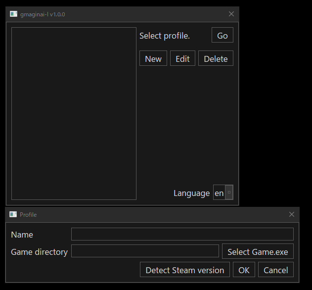

If you have the Steam version of CoAW and the installation path is the default one, clicking 'Detect Steam version' immediately set the 'Name' field to 'steam' and 'Game directory' to its path.  

Now you can just click 'OK' to complete.

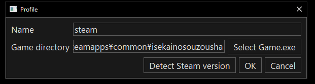

Otherwise, the auto-detection does nothing.  
Or, you might want to register the DLSite version of CoAW.  
In these cases, you should register your CoAW installation manually by following these steps: 

1. Enter a name of your choice in the 'Name' field.
2. Click 'Select Game.exe'. 
3. Navigate to the CoAW folder and select Game.exe.  
4. Click 'OK' to complete.

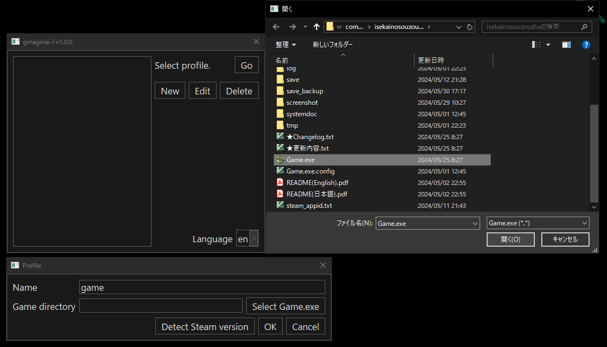

Now the profile you registered is shown in the profile list.  
Click the profile and click 'Go' to enter the mod manager for the installation.

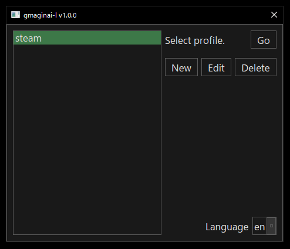

## Install the Mod Loader `maginai`
You should install the mod loader `maginai` to use mods in CoAW.

When you open the mod manager, 'Mod Loader' page is selected in the left sidebar by default and shows the installation state of `maginai`.

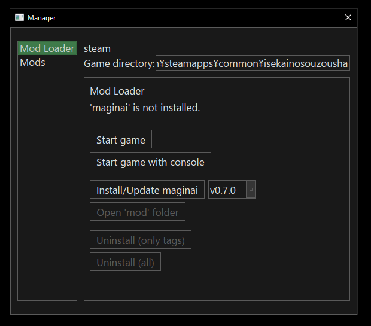

Click 'Install/Update maginai' and click 'OK's on the following dialogs.  
It's quite easy :)  

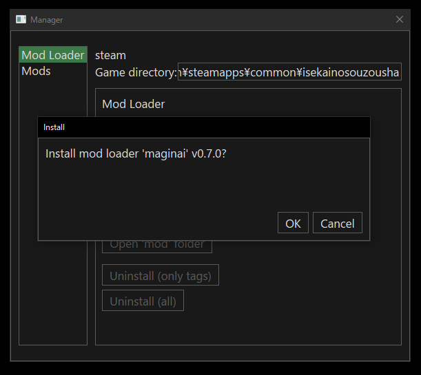

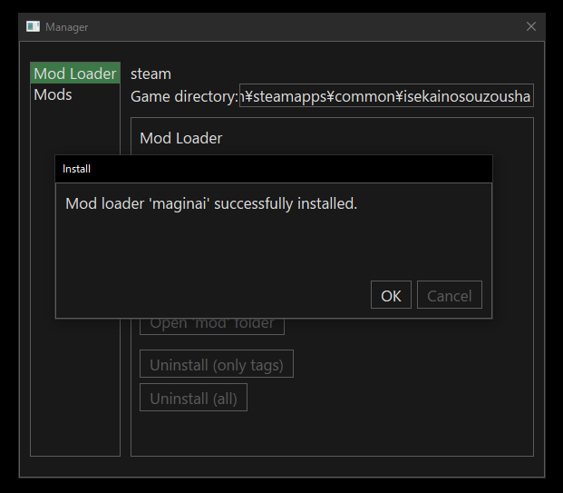

The installation state on the page will be updated upon completion.

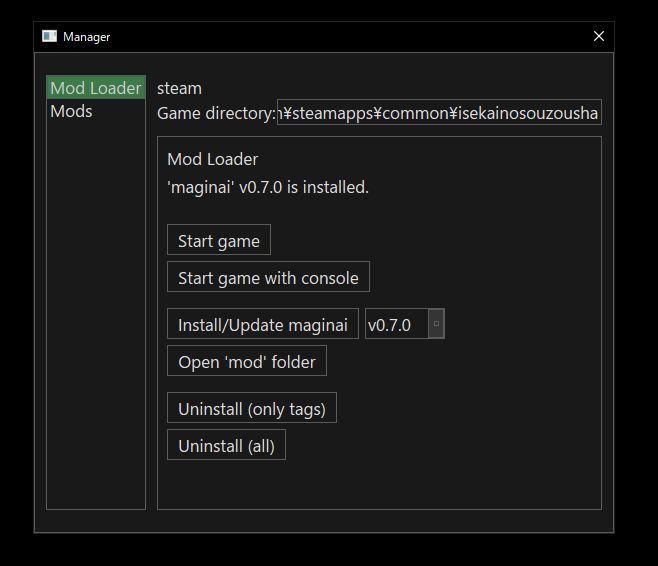

It's recommended to launch the game to see if `maginai` installed correctly.  
Click 'Start game'.  
If you see `Mod loader 'maginai' vX.Y.Z` in the left corner of the title screen, you have installed `maginai` successfully!

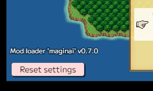

For the Steam version user:  
Make sure Steam is running! CoAW can't be launched without it.

## Update Mod Loader `maginai`
Updating `maginai` is the same as installing.  
`gmaginai-l` retrieves the version information of `maginai` automatically and the version selecter points the latest version by default, so you just need to click 'Install/Update maginai' to update `maginai` to the latest.

All mods you installed are migrated automatically, so you don't need to do anything else!

## Install Mods
First, you should get a mod from [Discord (CoAW modding)](https://discord.gg/RgYrD3uPZM) or another source.  
[README of maginai](https://discord.gg/RgYrD3uPZM) also has a mods list.

Now, as an example, let's try installing a sample mod, which just logs a message "sample modがロードされました" when the game starts.  
Download the distribution zip file from the following link.

https://drive.google.com/file/d/1dYoioGayloWRBwKY3CJtLIMJibTxRKb7/view?usp=drive_link

\* The download button is in the top-right corner.

We have a mod now, so select 'Mods' page from the left sidebar on `gmaginai-l`.

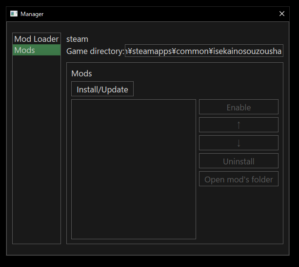

Click 'Install/Update' to open the install dialog.

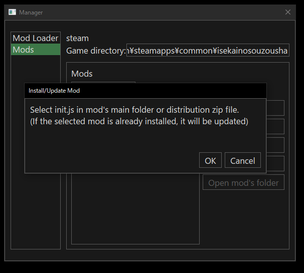

We have two ways to install: (A) from a distribution zip file and (B) from `init.js` in the mod's main folder.  
The former is easier, but depending on the situation, it might be unavailable (e.g. The mod distributor packs their mod with a format other than zip).

### (A) From Distribution Zip File
Click 'OK' button on the dialog and select the distribution zip file of the mod.  
For the sample mod we mentioned, it's `sampleMod-X.Y.Z.zip`, the file you downloaded (`X.Y.Z` is the version).

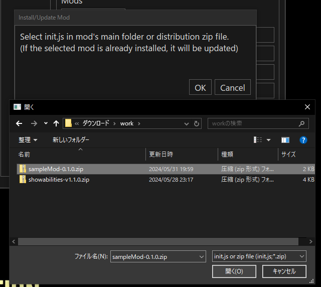

Click 'OK' or 'Next' on the following dialogs.

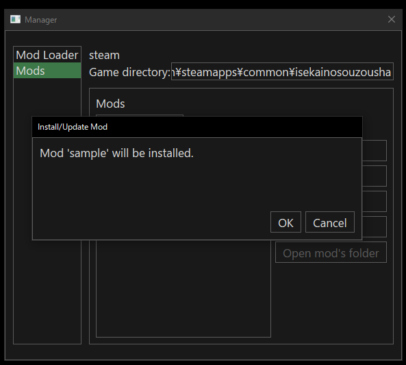

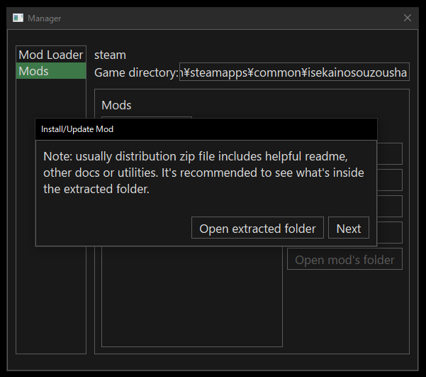

[What's the note?](#note-for-zip-install)

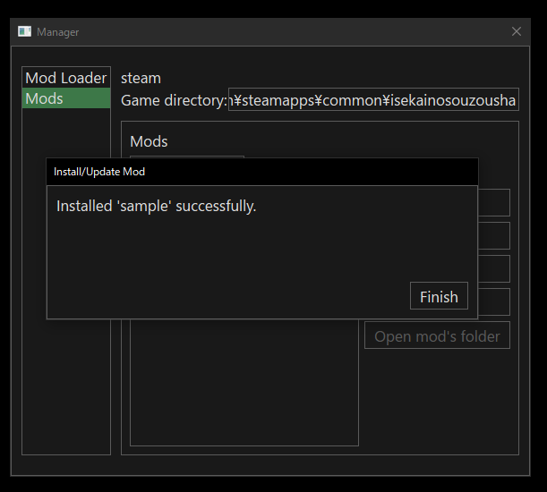

After completing the install, you will see the mod in the installed mods list.

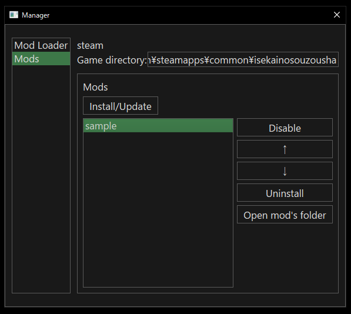

Done!

#### Note for Zip Install
The 'Note:...' message is displayed because the distribution zip file itself is not a mod.  
A `maginai` mod is actually a folder containing a javascript file named `init.js`.  
Distributors usually pack the mod folder and other useful recources into a zip file.  
If you ignore the other resources packed in the zip file, you might miss out on important information, so it's recommended to click 'Open extracted folder' to check them.

### (B) From `init.js` in mod's main folder
First, you should find the mod's main folder, which is a folder containing `init.js` file.  
The distributor of the mod usually tells where the mod's main folder is, so follow it.

For the sample mod we mentioned, you need to unzip `sampleMod-X.Y.Z.zip` you downloaded.  
`sample` in the extracted folder is the mod's main folder.  
You should select `init.js` in it on the mod selection dialog.

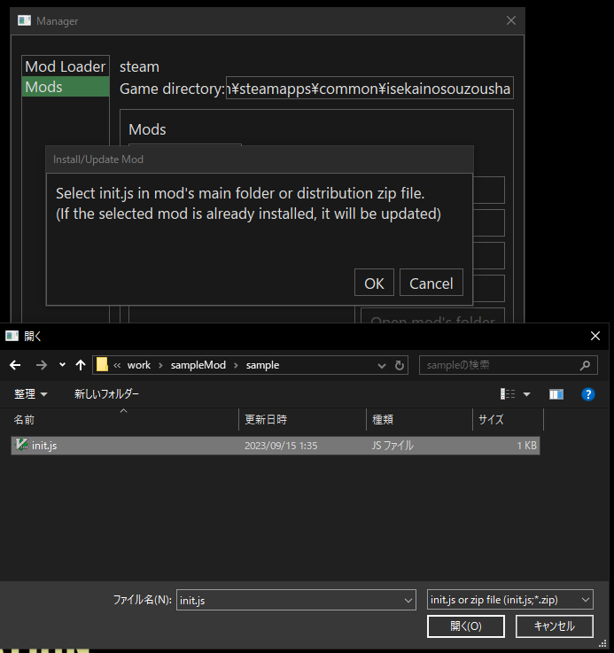

Click 'OK' on the following dialogs.

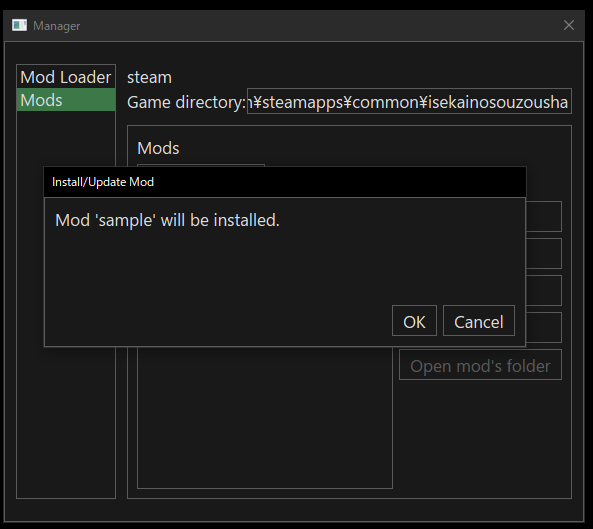

After completing the install, you will see the mod in the installed mods list.

Done!

### Test Installation
`maginai` v0.7.0 or later shows the all loaded mods on the title screen.  
Click 'Start game' on the 'Mod Loader' page to launch the game, and see the loaded mods.

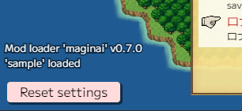

For the sample mod, you will see a message from the mod after you select a save.  

## Update Mod
Updating a mod is almost the same as installing, but you will see the following dialog when complete:

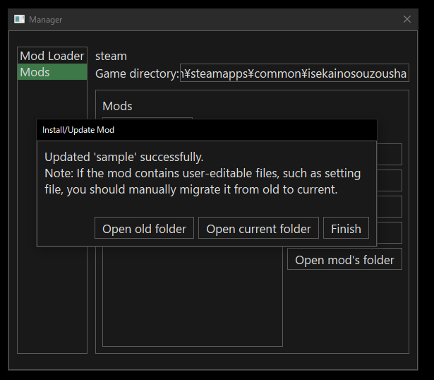

'Open old folder' and 'Open current folder' will help you migrate user-editable files.

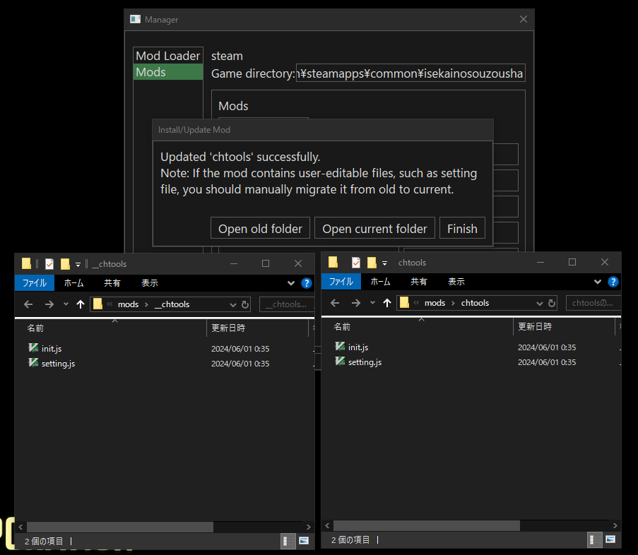

\* `gmaginai-l` makes a backup of old installation as a `__{modname}` folder before update. The 'Open old folder' opens it.  
\* The `__{modname}` backup will be deleted at the next update! If you want to keep it, copy it to another location manually.

Follow the distributor's instruction on migration.  
Just overwriting the current one with the old one might break the mod.  
(e.g. When the new setting file has new items that the old one doesn't)

## All Features

### Mod Loader Page

- Start the game
- Start the game [with the developer console](https://github.com/Spoonail-Iroiro/maginai/blob/develop/INSTALL_en.md#how-to-open-the-developer-console)
  - The developer console shows messages and logs from `maginai` and mods. It's useful for troubleshooting
- Install/Update `maginai`
  - You can specify the version to be installed with the version selecter
- Open `mod` folder
  - `mod` folder contains `maginai` code and all mods in `mods` folder
  - This function is for developers' debugging. Usually, mod users don't use it
- Uninstall (only tags)
  - Uninstall `maginai`, but all mods will remain. They are restored at the next reinstall
  - It's useful when you disable `maginai` temporarily
- Uninstall (all)

### Mods Page

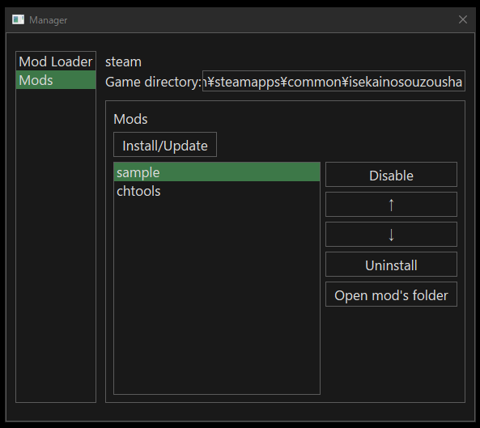

- Install/Update a mod
- Operations to the selected mod in the list
  - Enable/disable the mod
  - Change loading order
    - The order in the list is also the loading order
    - Use ↑/↓ to change the order
  - Uninstall the mod
  - Open the mod's folder
    - Mod's folder often contains user-editable files, such as setting files. You can access them quickly with this button

