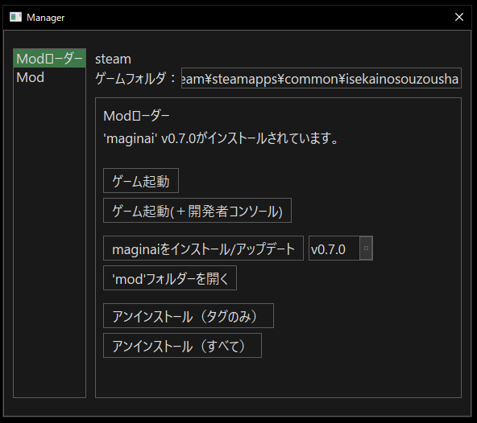

## セットアップ

最初に、`gmaginai-l`に異世界の創造者のインストール場所を登録するため、プロファイルを作成する必要があります。  
「新規」ボタンをクリックして、プロファイル作成ダイアログを開いてください。

Steam版の異世界の創造者がインストールされていてインストールパスがデフォルトの場合、「Steam版を自動検出する」をクリックすると、「名前」が「steam」に、「ゲームフォルダ」がそのパスに自動的に設定されます。
そのまま「OK」を押して完了してください。

自動検出が機能しない場合、またはDLSite版の異世界の創造者を登録する場合は、次の手順で手動で登録する必要があります。

1. 「名前」フィールドに好きな名前を入力
2. 「Game.exeを選択」をクリック
3. 異世界の創造者フォルダに移動し、Game.exeを選択
4. 「OK」をクリック

※ Steam版のインストールパスは、Steamライブラリの「ローカルファイルを閲覧」で見つけることができます。

登録が終わるとプロファイルがリストに表示されます。
プロファイルを選択し、「選択」をクリックするとModマネージャーを開くことができます。

同じ手順で、他のゲームフォルダ用にもプロファイルをいくつでも作成できます。  
(例：Steam版とDLSite版、異なるmodを導入したゲームフォルダを分ける等)

## Modローダー`maginai`をインストールする

Modマネージャーを開くとデフォルトで「Modローダー」ページが選択されており、maginaiのインストール状況が表示されています。

異世界の創造者でModを使用するには、Modローダー`maginai`をインストールする必要があります。

「maginaiをインストール/更新」をクリックし、後続のダイアログで「OK」をクリックします。

完了すると、インストール状況の表示が更新されます。

`maginai`が正しくインストールされたか確認するために、ゲームを起動して確認することをお勧めします。  
「ゲーム起動」ボタンでゲームを起動することができます。  
ゲームが起動した後、タイトル画面の左下に`Mod loader 'maginai' vX.Y.Z`と表示されていれば`maginai`が正常にインストールされています。

※Steam版異世界の創造者はSteamも起動していないと起動しません。うまくいかない場合はSteamが起動しているか確認してください。

### ネットワークエラー
インターネット接続でエラーが発生した場合、`maginai`のインストール/アップデートができません。  
画面には発生したエラーメッセージが表示されます。

この場合でも`maginai`のインストール/アップデート以外の機能は問題なく使えます。  
`maginai`のインストール/アップデートをしたい場合はネットワーク接続を確認してください。

## Modローダー`maginai`を更新する

`maginai`の更新はインストールと同じです。  
`gmaginai-l`は`maginai`のバージョン情報を自動的に取得し、バージョン選択用のプルダウンはデフォルトで最新バージョンを選択します。  
よって「maginaiをインストール/更新」をクリックして常に`maginai`を最新バージョンに更新することができます。

インストール済みのModは自動的に移行されるため、ユーザー側で行わなければいけない作業はありません。

## Modをインストールする

まず、[異世界の創造者Mod・改造 Discord](https://discord.gg/RgYrD3uPZM) や他の場所からModを入手します。  
[maginaiのREADME](https://github.com/Spoonail-Iroiro/maginai/blob/develop/README.md#%E4%BD%9C%E8%80%85mod%E3%83%AA%E3%82%B9%E3%83%88) にもModリストがあるので参考にしてください。

ここでは例としてゲーム起動時に"Loaded 'sample' mod."というメッセージをログに表示するサンプルModをインストールしてみます。  
以下のリンクから配布zipファイルをダウンロードできます。

https://drive.google.com/file/d/1dYoioGayloWRBwKY3CJtLIMJibTxRKb7/view?usp=drive_link

※ ダウンロードボタンは右上にあります

ダウンロードできたら、`gmaginai-l`の左のサイドバーで「Mod」ページに移動します。

「新規インストール/アップデート」をクリックして、インストールダイアログを開きます。

インストール方法は(A)配布zipファイルから、(B)Modの本体フォルダ内の`init.js`から、の2つがあります。  
前者の方が簡単ですが、状況によっては利用できないこともあります（例: Mod配布者がzip以外の形式でModを配布している場合）。

### (A) 配布zipファイルから

ダイアログで「OK」ボタンをクリックし、Modが含まれる配布zipファイルを選択します。  
サンプルModの場合、ダウンロードした`sampleMod-X.Y.Z.zip`（`X.Y.Z`はバージョン）が配布zipです。

後続のダイアログで「OK」または「次へ」をクリックします。

[この「ヒント：…」って何？](#このヒントって何)

インストールが完了すると、インストールされたModのリストにModが表示されます。

完了です！

#### この「ヒント：…」って何？

この「ヒント:…」メッセージは、配布zipファイルそれ自体はModではないため、注意事項として表示されています。  
`maginai`のModは、実際には`init.js`というjavascriptファイルを含むフォルダです。  
配布者は通常、そのModフォルダとその他の有用なドキュメント等をzipファイルにまとめて配布します。  
zipファイルに含まれる、Modフォルダ以外のドキュメントなどを無視すると、重要な情報を見逃す可能性があります。  
「解凍されたフォルダを開く」をクリックして確認することをお勧めします。  

### (B) Modの本体フォルダ内の`init.js`から

まず、`init.js`ファイルを含むModの本体フォルダを特定する必要があります。  
Modの配布者は通常、Modの本体フォルダがどこにあるかを案内しているので、それに従ってください。  

サンプルModの場合、まずはダウンロードした`sampleMod-X.Y.Z.zip`を解凍する必要があります。  
解凍したフォルダ内の`sample`がModの本体フォルダです。  
Mod選択ダイアログで、その中の`init.js`を選択してください。  

後続のダイアログで「OK」をクリックします。

インストールが完了すると、インストールされたModのリストにModが表示されます。

完了です！

### Modが正常にインストールされたか確かめる

`maginai`のバージョンががv0.7.0以上の場合、タイトル画面にロードされたすべてのModが表示されます。  
「Mod Loader」ページで「ゲームを開始」をクリックしてゲームを起動し、タイトル画面でロードされたModを確認できます。

サンプルModはゲーム開始時に「Loaded 'sample' mod.」というメッセージをゲームログに表示します。

## Modの更新

Modの更新はインストールとほぼ同じ手順ですが、完了時に次のダイアログが表示されます。

「旧Modフォルダを開く」と「現在のModフォルダを開く」ボタンは設定ファイル等の移行に役立ちます。

※`gmaginai-l`は更新前に、Modフォルダのバックアップを`__{modname}`という名前で作成します。「旧フォルダを開く」はそれを開きます。  
※`__{modname}`バックアップは次の更新時に削除されます！ 保持したい場合は、手動で別の場所にコピーしてください。  
  
設定ファイル等の移行は配布者の案内に従ってください。  
単に現在のバージョンを古いバージョンで上書きすると、Modがうまく動作しなくなる可能性があります。  
（例: 更新後の設定ファイルに新しい項目が追加された場合）  

## すべての機能

### Modローダーページ

- ゲーム起動
- [開発者コンソール](https://github.com/Spoonail-Iroiro/maginai/blob/develop/INSTALL_en.md#how-to-open-the-developer-console)ありでゲーム起動
  - 開発者コンソールは`maginai`およびModからのメッセージとログを表示します。トラブルシューティングに便利です
- `maginai`をインストール/アップデート
  - バージョン選択用プルダウンでインストールするバージョンを指定できます
- `mod`フォルダを開く
  - `mod`フォルダには`maginai`のコードが含まれ、その中の`mods`フォルダにすべてのModが含まれます
  - この機能は開発者のデバッグ用です。通常、Modユーザーは使用しません
- アンインストール（タグのみ）
  - `maginai`をアンインストールしますが、すべてのModは残ります。残ったModは再インストール時に再び使用されるようになります
  - 一時的に`maginai`を無効にする場合に便利です
- アンインストール（全て）

### Modページ

- Modを新規インストール/アップデート
- 選択しているModに対する操作
  - Modを有効化/無効化
  - ロード順を変更する
    - リスト内の順序＝ロード順です
    - ↑/↓ボタンを使用して順序を変更できます
  - Modをアンインストールする
  - Modのフォルダを開く
    - Modのフォルダには通常、設定ファイルなどのユーザーが編集可能なファイルが含まれます。このボタンで素早くアクセスできます
