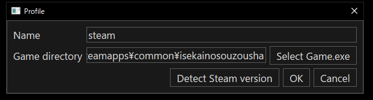
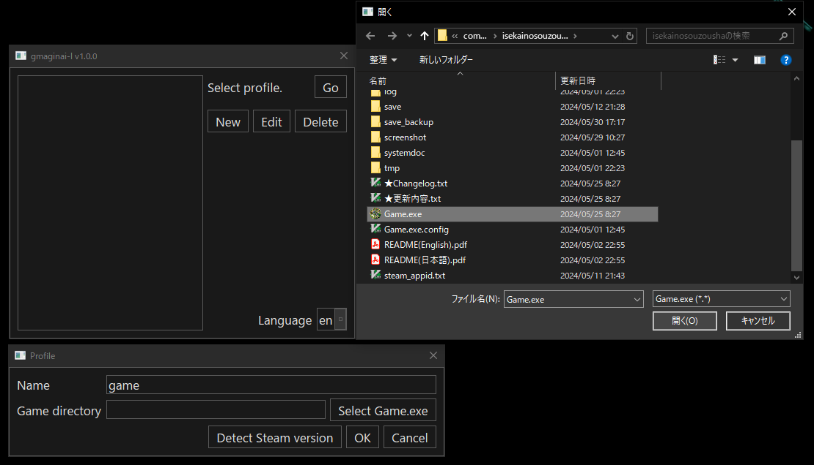
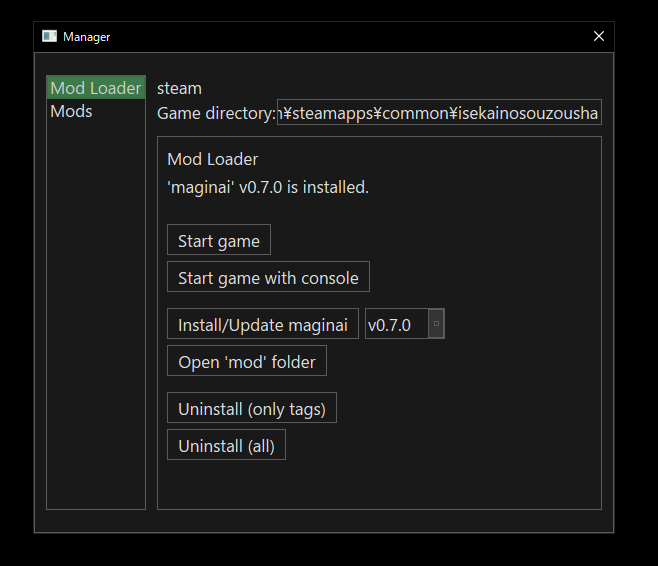
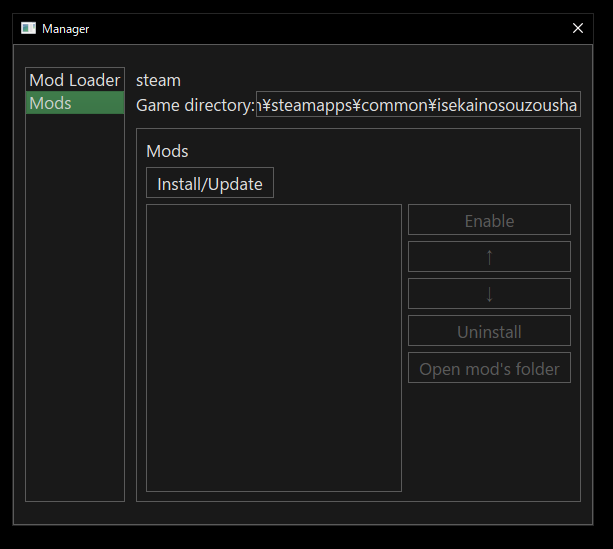
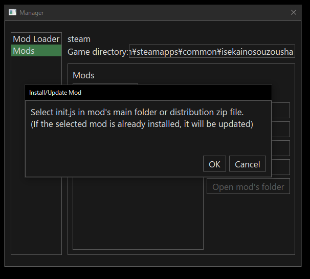
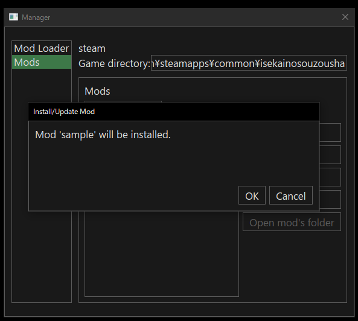
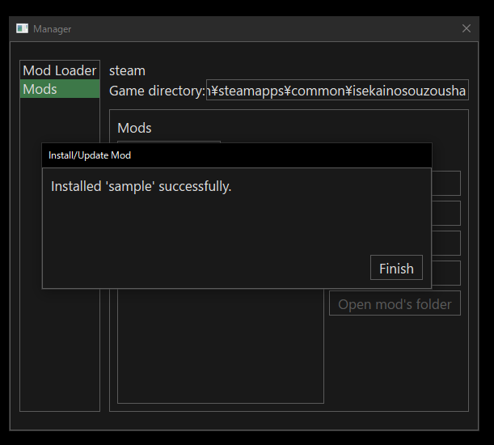
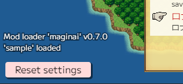
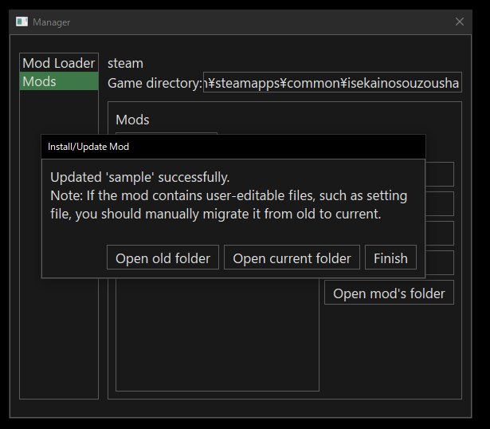
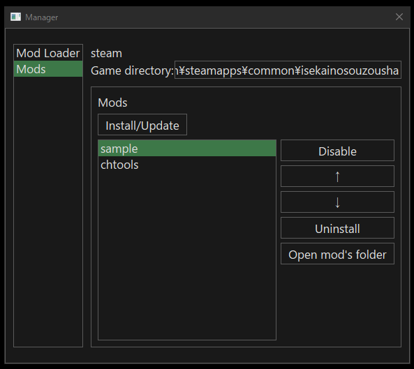

## セットアップ

まず、`gmaginai-l` に異世界の創造者のインストールを登録するためにプロファイルを作成する必要があります。  
「新規」ボタンをクリックして、プロファイル作成ダイアログを開きます。

Steam版の異世界の創造者がインストールされていてインストールパスがデフォルトの場合、「Steam版を検出」をクリックすると、「名前」フィールドが「steam」に、「ゲームディレクトリ」フィールドがそのパスに自動的に設定されます。

「OK」をクリックして完了します。

自動検出が機能しない場合、またはDLSite版の異世界の創造者を登録する場合は、次の手順で手動でインストールを登録する必要があります。

1. 「名前」フィールドに任意の名前を入力します。
2. 「ゲーム.exeを選択」をクリックします。
3. 異世界の創造者フォルダに移動し、Game.exeを選択します。
4. 「OK」をクリックして完了します。

\* Steam版のインストールパスは、Steamライブラリから確認できます。
（以下の画像のように「ローカルファイルを参照」をクリックします。）

登録したプロファイルがプロファイルリストに表示されます。
プロファイルを選択し、「開始」をクリックしてインストールのためのModマネージャーに入ります。

同じ手順で、異なる異世界の創造者のインストール用に複数のプロファイルを作成できます。

## Mod Loader `maginai` をインストールする

異世界の創造者でModを使用するには、Mod Loader `maginai` をインストールする必要があります。

Modマネージャーを開くと、左のサイドバーでデフォルトで「Mod Loader」ページが選択され、maginaiのインストール状況が表示されます。

「maginaiをインストール/更新」をクリックし、次のダイアログで「OK」をクリックします。

完了すると、ページのインストール状況が更新されます。

`maginai` が正しくインストールされたか確認するために、ゲームを起動することをお勧めします。
「ゲームを開始」をクリックします。
タイトル画面の左下に `Mod loader 'maginai' vX.Y.Z` と表示されていれば、`maginai` が正常にインストールされています！

Steam版を使用している場合:
Steamが起動していることを確認してください！ 異世界の創造者はSteamなしでは起動できません。

## Mod Loader `maginai` を更新する

`maginai` の更新はインストールと同じ手順です。
`gmaginai-l` は `maginai` のバージョン情報を自動的に取得し、バージョンセレクタはデフォルトで最新バージョンを指しています。
単に「maginaiをインストール/更新」をクリックして、`maginai` を最新バージョンに更新します。

インストール済みのModは自動的に移行されるため、追加のアクションは不要です！

## Modをインストールする

まず、[Discord (異世界の創造者 modding)](https://discord.gg/RgYrD3uPZM) や他のソースからModを入手します。
[README of maginai](https://discord.gg/RgYrD3uPZM) にもModリストがあります。

ここでは、ゲーム起動時に「Loaded 'sample' mod.」というメッセージをログに表示するサンプルModをインストールする例を見てみましょう。
以下のリンクから配布用zipファイルをダウンロードします。

https://drive.google.com/file/d/1dYoioGayloWRBwKY3CJtLIMJibTxRKb7/view?usp=drive_link

\* ダウンロードボタンは右上にあります。

Modをダウンロードしたら、`gmaginai-l` の左のサイドバーで「Mods」ページに移動します。

「インストール/更新」をクリックして、インストールダイアログを開きます。

インストール方法は2つあります: (A) 配布zipファイルから、(B) Modのメインフォルダ内の `init.js` から。
前者の方が簡単ですが、場合によっては利用できないこともあります（例: Mod配布者がzip以外の形式でModをパックしている場合）。

### (A) 配布zipファイルから

ダイアログで「OK」ボタンをクリックし、Modの配布zipファイルを選択します。
サンプルModの場合、`sampleMod-X.Y.Z.zip` というファイルをダウンロードしました (`X.Y.Z` はバージョンです)。

次のダイアログで「OK」または「次へ」をクリックします。

[メモは何ですか？](#note-for-zip-install)

インストールが完了すると、インストールされたModのリストにModが表示されます。

完了です！

#### Zipインストールに関するメモ

「メモ: ...」というメッセージは、配布zipファイル自体がModではないため表示されます。
`maginai` Modは実際には `init.js` というJavaScriptファイルを含むフォルダです。
配布者は通常、Modフォルダとその他の有用なリソースをzipファイルにパックします。
zipファイルに含まれる他のリソースを無視すると、重要な情報を見逃す可能性があるため、「抽出フォルダを開く」をクリックして確認することをお勧めします。

### (B) Modのメインフォルダ内の `init.js` から

まず、`init.js` ファイルを含むModのメインフォルダを見つけます。
Modの配布者は通常、Modのメインフォルダがどこにあるかを教えてくれるので、それに従います。

サンプルModの場合、ダウンロードした `sampleMod-X.Y.Z.zip` を解凍します。
解凍したフォルダ内の `sample` がModのメインフォルダです。
Mod選択ダイアログで `init.js` を選択します。

次のダイアログで「OK」をクリックします。

インストールが完了すると、インストールされたModのリストにModが表示されます。

完了です！

### インストールのテスト

`maginai` v0.7.0以降は、タイトル画面にロードされたすべてのModを表示します。
「Mod Loader」ページで「ゲームを開始」をクリックしてゲームを起動し、ロードされたModを確認します。

サンプルModの場合、ゲームを開始すると「Loaded 'sample' mod.」というメッセージがゲームログに表示されます。

## Modの更新

Modの更新は、インストールとほぼ同じ手順ですが、完了すると次のダイアログが表示されます。

「旧フォルダを開く」と「現在のフォルダを開く」は、ユーザーが編集可能なファイルの移行を支援します。

\* `gmaginai-l` は更新前のインストールのバックアップを `__{modname}` フォルダとして作成します。「旧フォルダを開く」は

それを開きます。
\* `__{modname}` バックアップは次の更新時に削除されます！ 保持したい場合は、手動で別の場所にコピーしてください。

配布者の移行手順に従ってください。
単に現在のバージョンに古いバージョンを上書きすると、Modが壊れる可能性があります。
（例: 新しい設定ファイルに古いものに存在しない新しい項目が含まれている場合）

## すべての機能

### Mod Loaderページ

- ゲームを開始
- [デベロッパーコンソール付きでゲームを開始](https://github.com/Spoonail-Iroiro/maginai/blob/develop/INSTALL_en.md#how-to-open-the-developer-console)
  - デベロッパーコンソールは `maginai` およびModからのメッセージとログを表示します。トラブルシューティングに便利です
- `maginai` をインストール/更新
  - バージョンセレクタでインストールするバージョンを指定できます
- `mod` フォルダを開く
  - `mod` フォルダには `maginai` のコードと `mods` フォルダ内のすべてのModが含まれます
  - この機能は開発者のデバッグ用です。通常、Modユーザーは使用しません
- アンインストール（タグのみ）
  - `maginai` をアンインストールしますが、すべてのModは残ります。再インストール時に復元されます
  - 一時的に `maginai` を無効にする場合に便利です
- アンインストール（全て）

### Modsページ

- Modをインストール/更新
- リスト内の選択されたModに対する操作
  - Modを有効/無効にする
  - ロード順を変更する
    - リスト内の順序はロード順でもあります
    - ↑/↓ を使用して順序を変更します
  - Modをアンインストールする
  - Modのフォルダを開く
    - Modのフォルダには通常、設定ファイルなどのユーザーが編集可能なファイルが含まれます。このボタンでそれらに素早くアクセスできます
